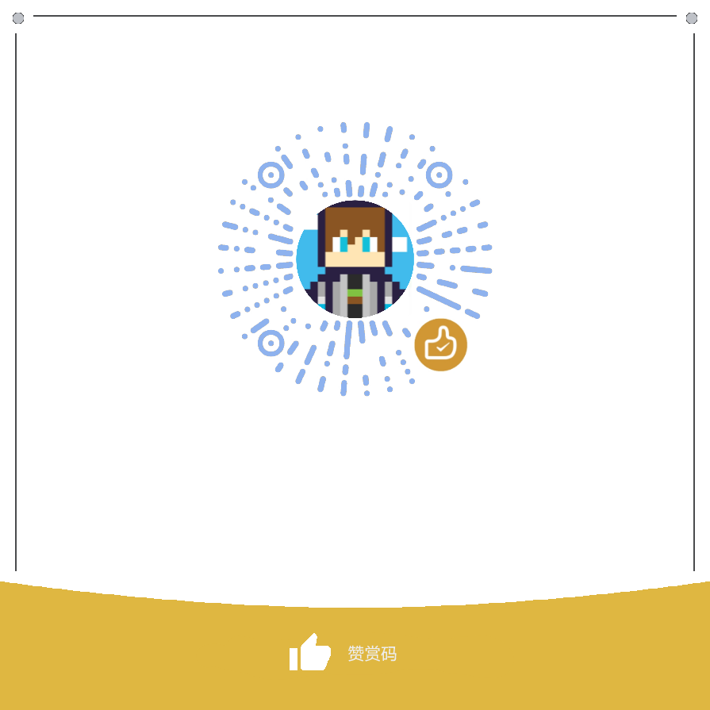

# 闲话
~~我很可爱，请给我钱~~

虽然说本人的生活状况暂时不是很需要钱，但是考虑到博客的运行需要一定的开销，所以还是开通了捐赠通道。

目前博客的开销：
- 域名：`$12.18/年` (~¥85/年，Cloudflare)
- 服务器：`€5.26/月`（~¥500/年，netcup [VPS 1000 ARM G11,6c8g](https://www.netcup.com/en/server/arm-server/vps-1000-arm-g11-iv-mnz#vps-1000-arm-g11-nue-iv?ref=246155)，用于站点统计及[其他服务](/services)）
- 站点托管：`¥0/年`（Cloudflare）

# 捐赠方式
## 置顶位
[skimit 星宫: 一个 Minecraft 生存+ 服务器](https://skimit.net/zh/)：Minecraft Java 原版公益服

<!--腐竹是可爱猫猫，写在注释里应该没人看见（缩）-->

## 不花一分钱支持本站
主要是自用机场的aff，如果你需要的话可以用我的链接注册，我会从中得到一点点收益。

以下内容并没有收到任何赞助，~~没人找我~~

[prprCloud - 通过多项多种黑科技，先进可靠的网络设施，优质尖端的资源，快速稳定的全新协议，保证您的体验，体验宛若身在海外的访问速度](https://prpr.96110.cn.com/aff.php?aff=81)

[小小布吉岛~](https://app.bujidao.org/register?code=AhnLeqDo)

[DigitalOcean - 新注册送2个月200$余额](https://m.do.co/c/fdd1eeed5938)

<!--[Facmata - 新兴机场，优质原生ip解锁](https://dash.fmta.boo/#/register?code=vNjq7j0F)-->

<!--[RioLU.443｜精靈學院 - 安全、快速、高可用的加速服务提供商](https://o.riolu.ooo/register?aff=mXBXaLWa)-->

想添加一些内容？可以通过[Telegram](https://t.me/Grass_block)联系我。
## GitHub Sponsors
感谢群友提供的技术支持，现在可以前往 https://github.com/sponsors/GrassBlock1 以赞助！

<iframe src="https://github.com/sponsors/GrassBlock1/card" title="Sponsor GrassBlock1" style="border: 0; width: 100%; height: 100%"></iframe>

## Ko-fi
Ko-fi 是一个支持创作者的平台，你可以通过这个平台给我买杯咖啡。（支持 PayPal 进行支付）

在上面开了一些付费服务，可以帮忙制作图片水印以及一些帮助架设服务（包括博客！），你可以点击下面的页面中的 `Requests` tab 来了解。

（填写 `GBLAB` 优惠码会有 20% off，[直达链接](https://ko-fi.com/grassblock/link/GBLAB)）

## WeChat 赞赏码

## 爱发电（长期没有使用，不太推荐）
一次性或长期均可。

https://afdian.net/@Grass_Block
## 区块链上的钱包
Polygon 主网：`0x7974F5eBF9e8c63308BBC3EA0E86Aaa67902a953`

USDT: `0x7974F5eBF9e8c63308BBC3EA0E86Aaa67902a953`

TON: `UQBB-HSZMV_wqg1RLcAOl4rBCE9pGJeunCz01THQrkWHrLjM`

以下是当初为了弄xlog搞的：

主收ETH，别的不太会弄，如果要投入其它币种请联系我。

钱包地址：    `0xE25E227e5B9cc5855dD60a169a2203a55488035B`
# 去向
除了续费域名和托管服务，剩下的钱会收入囊中，用于有需要的时候给自己买吃的（

公益捐款暂时不考虑，因为我也不太敢相信这种东西。
# 感谢
感谢2020年以来包括但不限于`科学边界`以及`互联网迷因研究协会`的群友提供的帮助！如果你的捐赠超出了 1$（或者5¥），你的名字就会随附留言出现在下面（当然你也可以选择不在此显示）。

@misaka4a92