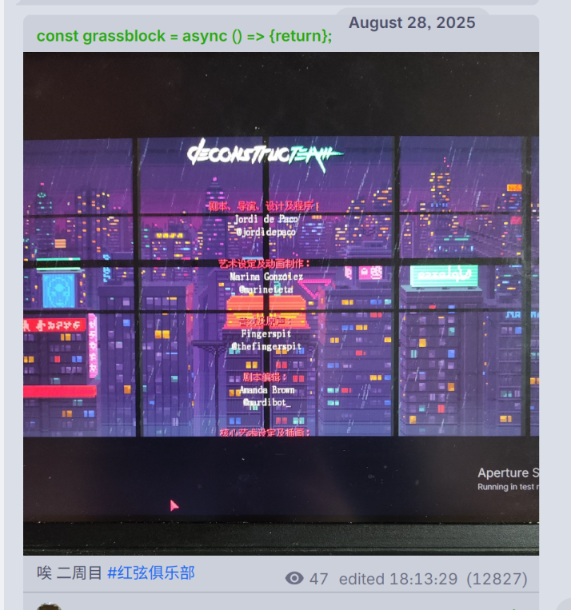
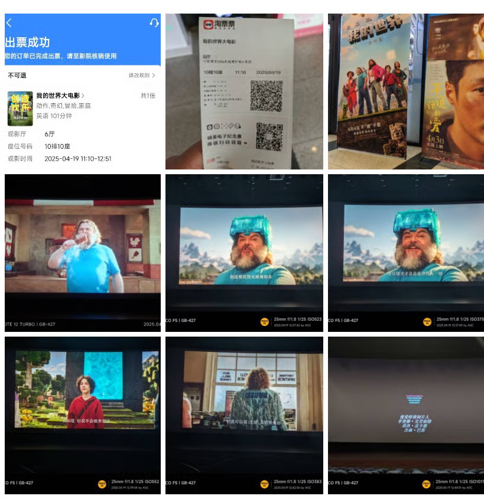
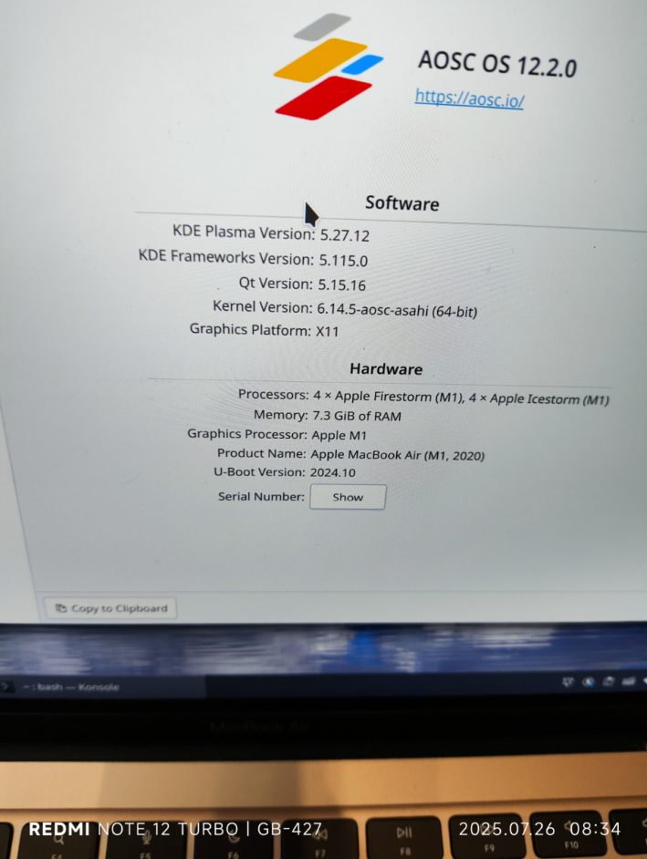

亲爱的观众朋友们过年好啊（哪儿有人啊这个），又到了这个啊一年一度大家都开始解冻的时节了，为了证明我还活着，我只能先把别的草稿都放一放，先把这个写出来吧。

2025 年也是真的快过去了，如果说年初的那会儿我的精神状态还是“飞机上挂暖壶（怎么讲）有较高的水平”（您就这片汤话说的顺溜），那么年末的时候的我觉得这个暖壶应该是直接坠机了（man！），至于为什么等后面的部分应该会讲吧，虽然我觉得把之前的事情直接拿出来鞭尸其实是不太好的，但是为了把事情交代清楚我还是觉得说出来会比较好。

## 1

转眼间一年又过去了，我对于时间的感知也是更加的模糊不清了。我感觉，我的脑子早已经被留在了2024年之前，以至于我想知道自己真实的年龄，还需要在脑子里做一遍减法，然后才能告诉别人。不过想到以后的日子会越过越快，我的心里似乎也没什么太大的感觉，只是感觉我实行内心的想法可能需要抓紧时间了，不然以后只会更没有时间。

也不知道为什么，把年前的 deadline 全都赶完，再次打开年终总结的时候，居然是年前乃至这个学期最后一节课的课堂上，大抵是拖延症又发力了吧。可能你们看到这个文章，也是在年后了，在此但愿我能很快地完成吧。

## 2

因为我的记性还没到那种很好的程度，所以我一时半会儿还真的说不上来这一年我有做什么很重要的事情，至少对于公认的“重要”的事情来说，我确实没有做。

我想到那个说[中国人每年都是关键的视频](https://www.bilibili.com/video/av1252820211)，其实从另外一个角度来说，每年都是关键，那么每年都不是关键：

> 我觉得没毛病，都是转折点，不就画成一个圆了嘛？很多人终其一生，不就是怀揣梦想在原地打转嘛？

这话说得在理。

其实做了多少也没有那么重要，忙忙碌碌也好，无所事事也罢，好在是活下来了，便还有希望在的。

对于我个人来说，这一年也可以说是做了点事情的，因为不是我们这次总结的重点，所以就随便说两句吧：

> 📅 注：这部分的“今年”，若无特殊说明都指 2025 年。

今年八月底的时候，我第二次带着成就玩完了《红弦俱乐部》，写下这段的时候一直认为今年玩了两次，结果翻了一下第一次是在24年年底的时候，不得不感慨自己的记性有点差了。关于这个游戏，我有很多想说的，草稿已经建好了许久，所以在这里不展开，等我把缺失的两个成就打完之后，就开始写吧。

同时，今年也是我第一次正经地进入电影院看电影。4 月 19 日，在强烈好奇心的驱使下，我观看了 Minecraft 大电影，虽然没有像群友那样看电影还可以拿到周边（说实话连周边的影子都没见到），但是精神上仍然获得了满足。

今年再次翻新了实验室（就是你现在看文章的地方），从 Hugo 搬家到 Astro，这期间做了不少折腾，有时间会另写一篇文章来讲述。新的实验室从五月份起开始立项折腾，一直到九月份才正式迁移，这里面发生的事情还是有亿点可以说的的。

今年还去了上海，第一次出了这么远的门，本来想写一个游记来着，但是此后的日子里，一直都没有这样的精力，半年过去了也没有写。不过还是要感谢 AOSC 社区开了这么一个会议，孩子玩得很开心。

## 3

转眼间就到了考试周的周末，我回家也已经有几天有余，虽然还是未能及时发布年度总结，但倒是也符合我拖延的精神状态（拖延不好，大家不要学）。

这一年的精神状态其实并没有什么改善，也正如开头的我写下的暖壶坠机（好烂的梗啊）一样，去年年初发的文章回头一看其实很多情况并没有得到解决，而我自己也不知道怎么解决。

正当我还为了这些事情发愁的时候，生活再次以大运的形态创了我，让我半不知情地丢掉了喜欢的人。现在想来，似乎一切都只是我的疏于表达和单相思。生活里从不缺乏NTR，但如果自己是那个苦主的话，似乎也不能从中获得什么开心的事情用以取乐。都说人要向前看，但似乎我已经无法从中脱身了。

我的眼界有限，也不知道这个世界到底是变得更好还是更坏。今年虽然很想写文章，但是最后也是只有年初的时候发的文章一篇。看到那篇文章的评论获得很多共鸣，心里面也有一点慰藉，可能这些至少不是我一个人的错。在此谢谢这些发评论的人。

不知道该怎么往下写，但是突然想起来这么一段话：

> _每个人都有自己的桎梏：  
> 家庭、种族、社会地位、性别、财富......  
> 即使是手握强权和特权的人也有自己的负担。  
> 消极情绪冲击着我们每一个人，毫无区别，无论你是乞丐还是摇滚巨星......_

可能放到现在的确如此吧，虽然这也只是一个七八年前的游戏里面的一段话罢了。

## 4

这个文章好像快要写完了吧，虽然因为我的 Notion AI 额度用完了，所以我也不能对着AI问什么人生问题来作为文章的结尾。

因为很明显只是诉苦并不能起到一个积极的作用，所以诉苦的部分就暂时写那么多。

虽然很明显晚饭后因为太困导致无法创作，效率会下降，但我又喜欢把白天的事情拖到晚上，导致创作这一块儿又开始卡壳了，又或者单纯只是体力不支吧。

虽然说25年五味杂陈，但我相信26年一定会更为混乱（废话），至少站在现在，我不确定未来会发生什么，希望26年会更好吧，不过“下周再问我的话，说不定我会给出不同的答案。”

就像某位游戏区up回归更新的视频里半故意把omori的o全部写成0也会引来圈子的不满一样，我所做的和我所为的也没有比这种文本替换高明到哪里去，只是故伎重施以此来减少一点似有似无的无意义批评罢了。

以后应该不会再有年度总结了，我应该会更注重其他内容的写作吧，毕竟说实话，草稿箱里有很多亟待我去写的文章呢。

总之谢谢你听我说一些稀里糊涂的话，祝你快乐，祝长生不老永远不死。

## 5

> 余少能视鬼，尝于雪夜野寺逢一提傀儡翁，鹤发褴褛，唯持一木偶制作极精，宛如娇女，绘珠泪盈睫，惹人见怜。  
> 时云彤雪狂，二人比肩向火，翁自述曰：少时好观牵丝戏，耽于盘铃傀儡之技，既年长，其志愈坚，遂以此为业，以物象人自得其乐。奈何漂泊终生，居无所行无侣，所伴唯一傀儡木偶。  
> 翁且言且泣，余温言释之，恳其奏盘铃乐，作牵丝傀儡戏，演剧于三尺红绵之上，度曲咿嘤，木偶顾盼神飞，虽妆绘悲容而婉媚绝伦。  
> 曲终，翁抱持木偶，稍作欢容，俄顷恨怒，曰：平生落魄，皆傀儡误之，天寒，冬衣难置，一贫至此，不如焚，遂忿然投偶入火。吾止而未及，跌足叹惋。忽见火中木偶婉转而起，肃拜揖别，姿若生人，绘面泪痕宛然，一笑迸散，没于篝焰。  
> 火至天明方熄。  
> 翁顿悟，掩面嚎啕，曰：暖矣，孤矣。

credits:

“飞机上挂暖壶（怎么讲）有较高的水平”来自[《俺们的春联》](https://www.bilibili.com/festival/VSF2024live?bvid=BV1Lm41197Rw&t=253)

“都是转折点，不就画成一个圆了嘛”的论述来自[《我的一生中，为什么每个阶段都那么重要？！》中的评论](https://www.bilibili.com/video/BV19J4m1G7bS?comment_on=1&comment_root_id=216067856640&share_tag=s_i#reply216067856640)

“每个人都有自己的桎梏”的引用来自红弦俱乐部的文本

“某位游戏区up回归更新的视频里半故意把omori的o全部写成0”的部分请自行在b站搜索“作者发烧13年做出来的游戏”，并查看相应视频的标签部分

最后这一段莫名其妙的古文来自 [【牵丝戏】原版 - 银臨&Aki阿杰_哔哩哔哩](https://www.bilibili.com/video/BV1js411U7mR/)

