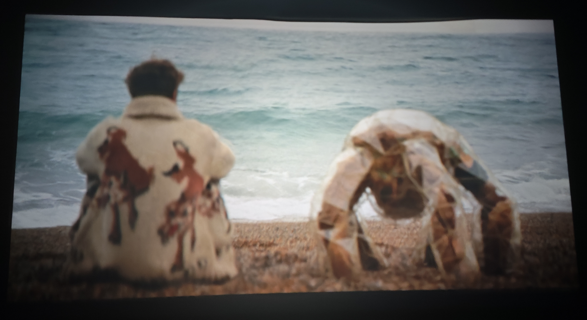
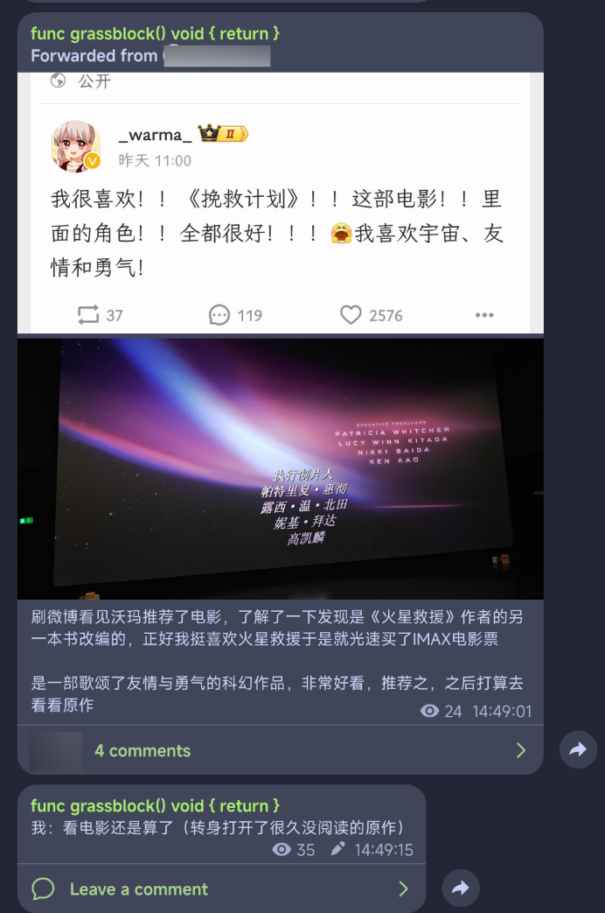
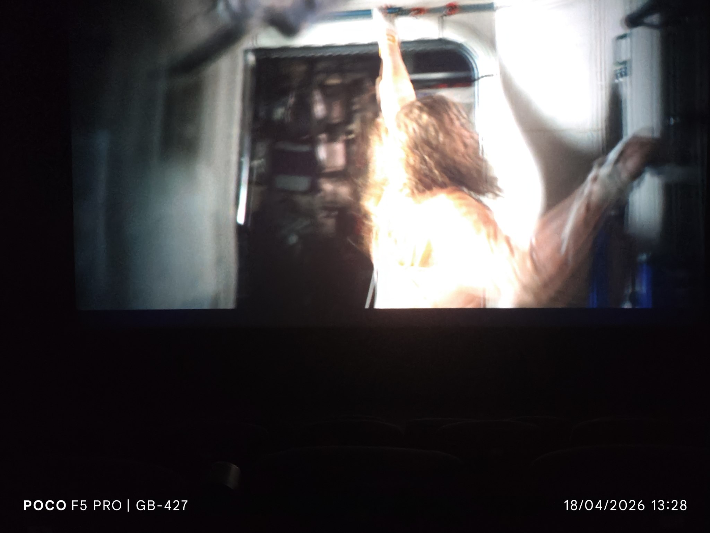

---
categories:
- Daily
date: 2026-05-01T15:02:00
updated: 2026-05-04T22:20:00
description: 一部勇气和友谊的赞歌。
draft: false
slug: project-hail-mary
summary: 我们在大量的人类情感当中发现了少量科幻，不过或许我们正需要这种情感的力量。
tags:
- 挽救计划
title: 看过《挽救计划》之后
---
import Spoiler from '/src/components/shortcodes/Spoiler.astro';

> ⚠️ 虽然我已经尽可能地减少了剧透，且尽可能地加上了遮罩，但本文仍然可能包含剧透成分。如果影响到了你的体验，在此致歉。

> 🤔 本文是我自己在 neodb 上的评论的汇编，虽然结构和内容上和评论已经相差甚远了，但是本质上还是炒冷饭。

> 🚧 文章监修中，主题内容已经完成，但内容未来可能会删改。

去年的时候，我看到了《挽救计划》的预告片并且转发到自己的频道（虽然直到写文章的时候才发现我转发过），说自己只是把原著下载下来，还没有看过。
但我慢慢地忘记了这个预告片的事情，也忘记了因为在 Z-Library 瞎逛时看到宣传"《火星救援》原作者"（虽然《火星救援》我也没看过)于是一直在硬盘里吃灰的原书。
时间来到今年的三月底，看到别人转沃玛的微博截图说《挽救计划》上电影版了，并且给了一个很高的评价。

这时我才重新想起来它们，于是接下来花了几天的时间阅读了当时下载的译本。

我个人觉得这本书挺好的，在幽默的同时又不缺失科学性，两个人（？）的友情也值得动容，结局排除掉一些汉尼拔（指<Spoiler>"我肉汉堡"</Spoiler>）的要素以外，对主角以及我来说也算不错，算是个圆满的结局。我觉得如果是相反的结局的话可能就是发刀子了，万幸作者没有这么做。

自此，我便沉浸在"一个人在外星和外星朋友生活"的这种氛围之中。在暗自羡慕他们的友情的同时，我也对譬如"洛基长什么样子""声音又是什么样的"等等问题产生了好奇。

不过~~好在我记性比较差~~，这股好奇没多久就消散了。直到我看完书大概一周之后，B 站的大数据鬼使神差地向我推荐了官方账号发的相关视频（索尼这招太狠了），我看过这个视频之后起初的好奇逐渐的变成了"我得去看看这个电影"的紧迫感，并因此内耗了好久。

因为中间有课，不能去看，于是就这样被折磨内耗了好几天，拖到了那一周的周五买了影票，并且周末跑去看了。

好在一切顺利，坐在放映厅里我才发现这场只有我一个人看，~~嘻嘻~~。

电影提前开始了几分钟，还自动跳过了片头各个制片公司的部分，还怪贴心的（虽然可能不太好吧），而且观看体验也还不错。

回到电影本身。如果把原著比作源码的主分支，那么这个电影改编我觉得就是主要在精简甚至删除各个功能的分支（什么奇怪比喻），所以有点遗憾的是因为时长有限，或者是可能的从 157 分钟到 131 分钟的删减（不过这多出来的二十分钟能表现出什么呢），许多在原著当中看起来很科学很硬核的地方没有表现出来，或者表现的比较仓促。

不过对于友谊的表现这一块儿我觉得非常的可以，给我的冲击比原著还要大一些（可能是画面比文字更能令人感动吧，不过我为什么没有这样的朋友呢（小声）），着重表现这最有看点和最能表现整体的主题的部分也算是情有可原。

该给的气氛不管是配乐和画面也给到了，另外洛基的那个 TTS 是真的好听，分镜转场也很丝滑。

总体来说故事相较于原著有变动，但电影虽然最后也以格雷斯教波江座人科学为结尾，但比原著的结局更为开放式，也给了格雷斯一个更好的结局，至少飞船修好了，还有回家的可能性，看起来也没老多少，不过<Spoiler>我肉汉堡</Spoiler>呢

但是地球呢？用 perplexity 查了一下，发现电影里<Spoiler>斯特拉特最后可能被终身监禁了</Spoiler>（我傻我没看出来），嗯...只能说样品到达了地球，地球至少得救了吧，不过对于斯特拉特本人来说可能不太好，算一个中上的结局。

这样的改编和缩减虽然仓促，但内核和主题想必没有很大的变化，我还是很满意的，期待后续吧。

如果要打分的话，扣一分给没有完成故事的遗憾吧，别的确实好，等流媒体出来之后我想把画面当壁纸用...

amaze amaze amaze

---

碎碎念：最近换了一个新的写作工作流，还在适应当中，主要是 Obsidian 里面的图片的格式似乎和一般的 markdown 不一样，并且我的同步插件好像坏了，等我后期多调整吧。