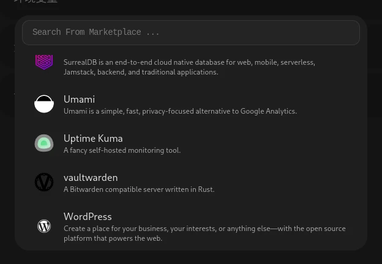
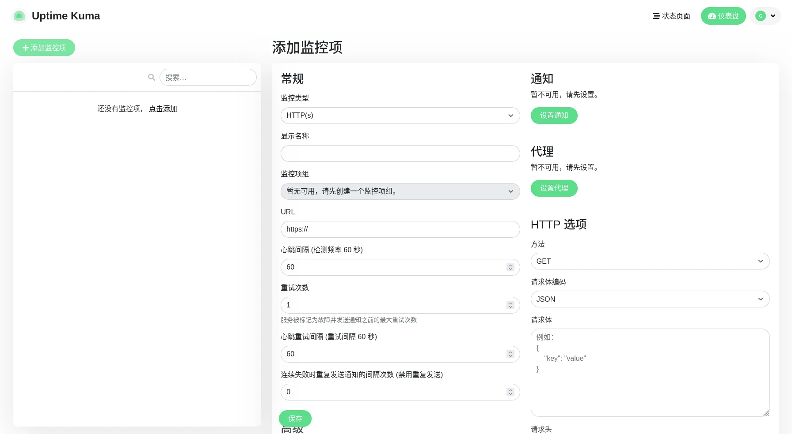
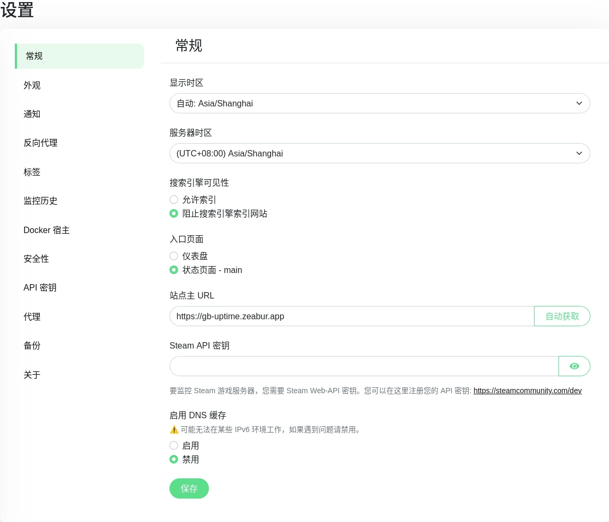
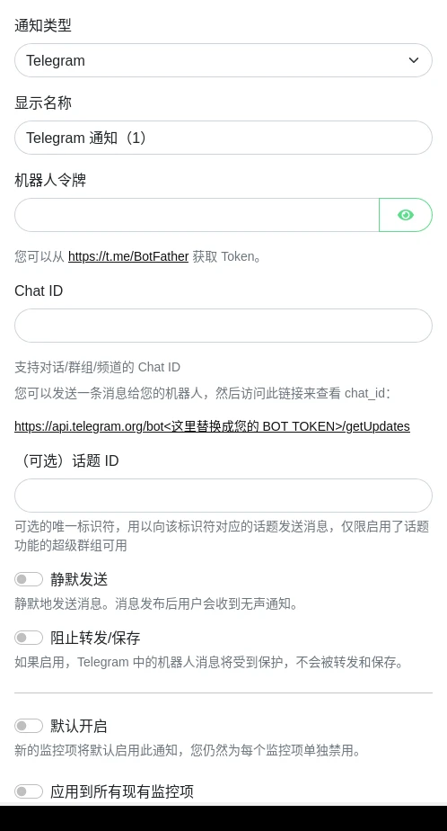

<!-- 万事开头难啊 -->
作为一个折腾人，难免会在各种各样的地方架设不同的服务，或是测试，或是公开出来给大家用，而服务架设了放养不管也是一种不负责任的行为，所以就免不了要弄个服务来监控自己的服务，防止炸了之后自己都不知道，起初我是用的 [UptimeRobot](https://uptimerobot.com/)，但是这个服务有诸多的问题，比如免费版选项太少，基本没办法自定义监控页，于是开始寻找替代品。

期间我尝试了完全利用 Github 相关服务的 [upptime](https://github.com/upptime/upptime) 和 已经不维护了的 [statusfy](https://github.com/juliomrqz/statusfy)，但它们都有各自的问题，最终在某个项目的状态页发现了 uptime-kuma ，在试用一段时间之后，我觉得它是比较合乎我心意的一个项目。

# 介绍

既然说到这里，就来介绍一下说的两个工具吧。

[uptime-kuma](https://github.com/louislam/uptime-kuma) 是一个 **开源** **可自建** 的网站监控服务，类似于一众服务，它提供各种各样的监控服务，比如 HTTP、TCP、DNS、Ping、证书 等等。

[Zeabur](https://zeabur.com?referralCode=GrassBlock1) 是国人开发的一款服务部署平台，无论使用什么编程语言或开发框架，只需要通过几个简单就可的以部署，常见的 Vaultwarden、Halo、Umami 都能部署，甚至连 WordPress 都可以。

而对于我来说，家中实在没有一台可以24小时不间断开机的设备，而且我也没有合适的服务器，所以我选择了serverless部署。

这里使用 Zeabur，它对 Uptime Kuma 的支持可以说是开箱即用，而且按用量计费，对于小规模使用来说，日常使用基本不会超过每月的五美元免费额度，是非常划算的。

# 部署

可以点下面的按钮套用模版，一键部署：

还可以手动创建项目，在新建服务时选择 `Marketplace` 并找到 `Uptime Kuma`，直接部署。

部署完成后，点击 `域名` 来绑定一个域名，你可以使用 `生成域名` 来将 `*.zeabur.app` 作为二级域名，也可以使用自己的域名

如果要使用自己的域名，需要在你的域名解析商那里添加一条 `CNAME` 记录，将你要使用的域名指向 `zeabur.app`，然后在 Zeabur 中添加域名，等待几分钟即可。

绑定域名成功后，点一下绑定的域名即可访问，不需要额外的配置。

# 配置

部署成功后，打开你所绑定的域名，注册管理员账户并按需求创建监控项即可，支持 HTTP、TCP、DNS、Ping、证书 等等。

## 添加状态页面

和 UptimeRobot 一样，uptime kuma 也可以创建一个**可自定义**的状态页面，用于展示你的服务的状态。

如果你想要将状态页面设置为访问域名时的默认页面，可以在 `设置` > `入口页面` 中选择你刚刚创建的状态页，最后点击’保存‘即可，这样访客访问你设置的域名时就会直接看到你的状态页了。

## 设置通知

转到设置，然后点击 `通知`，随后点击 `设置通知`，你可以在这里设置通知的方式，包括邮件、Telegram、Ntfy、Server酱、Matrix等50多种方式，你可以根据自己的喜好来选择配置。

设置好之后，记得在已有的监控项中设置通知方式，否则你将无法收到通知。（或者直接在添加通知方式时直接选择 `默认开启` 并 `应用到所有监控项`，省事）

# 备份

uptime kuma 预置的备份功能上已经年久失修，也因此产生了许多问题（如无法备份完整的数据），在设置中的备份选项中也已经表明了这一点。

所以如果你想要备份，只能依靠备份容器等等类似的操作进行。

Zeabur 备份的话，开发者表示会在后续加入备份功能。

# 结语

Uptime Kuma 作为一个开源可自建的监控方案，它降低了个人管理服务的门槛，也让更多人免于 UptimeRobot 的限制，我希望这个项目能够越来越好，也希望大家能够喜欢它。

Zeabur 作为一个无服务器部署方案，它让更多人可以在云端部署自己的服务，让开发者免于部署服务的困境，而且社区支持友好，在这里希望它能一直做下去。

最后，感谢你的阅读，如果你有什么问题，欢迎在评论区/公告板对应帖提出，我会尽量回答。

# 延伸阅读

[Deploy Uptime Kuma - Zeabur](https://zeabur.com/docs/marketplace/uptime-kuma)

[louislam/uptime-kuma: A fancy self-hosted monitoring tool](https://github.com/louislam/uptime-kuma)
